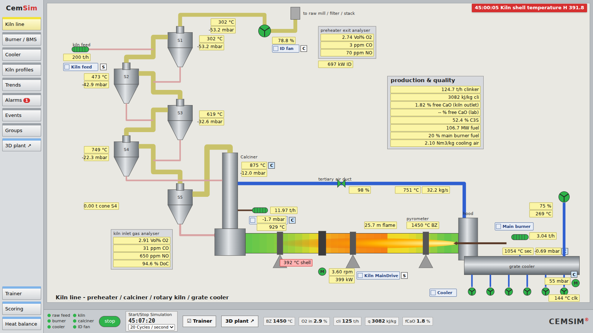
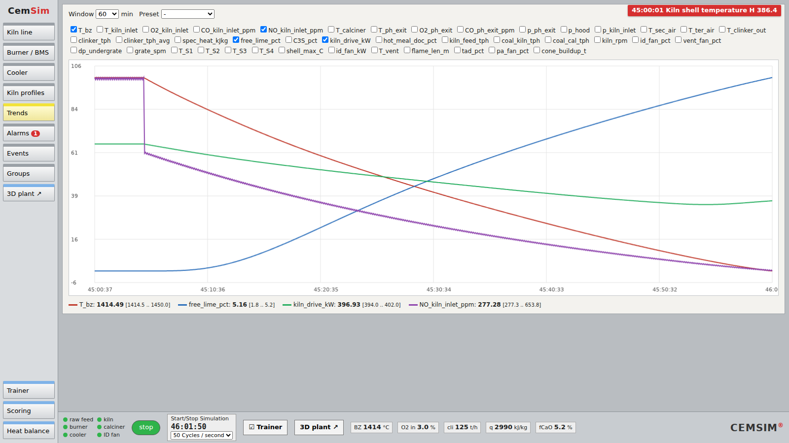
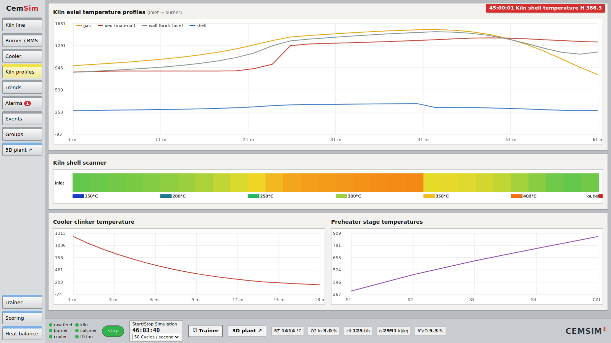
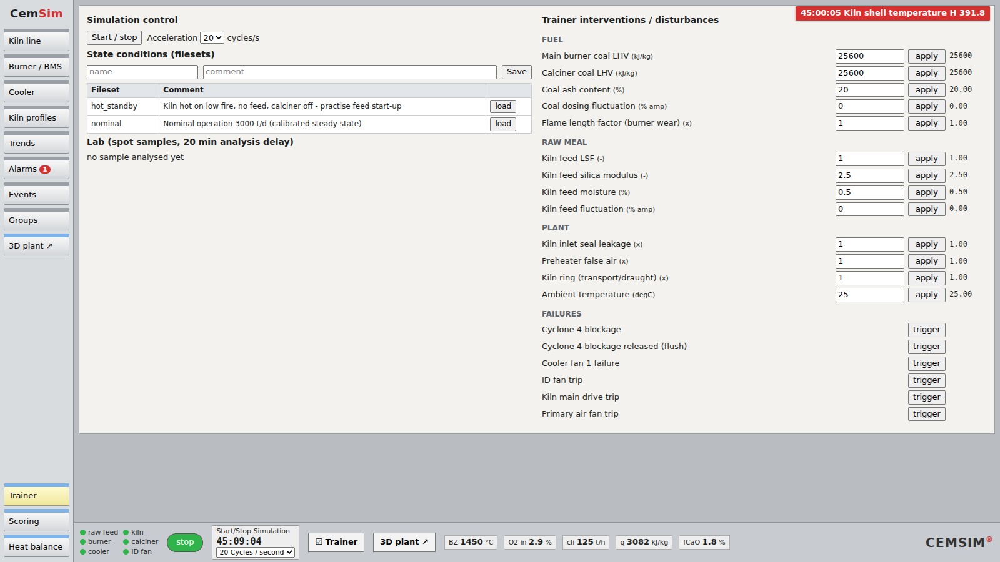
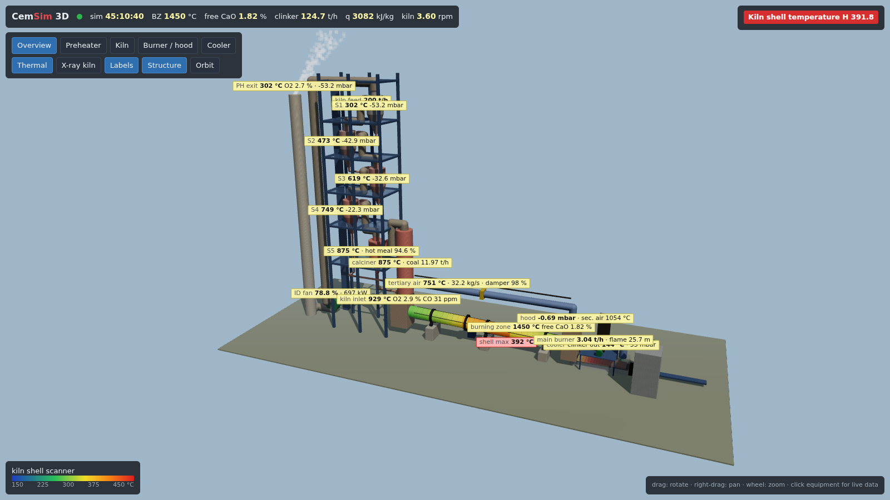
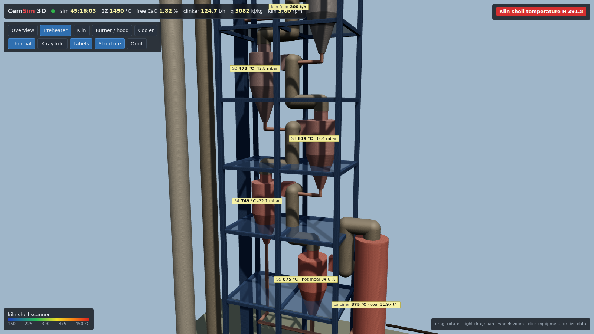
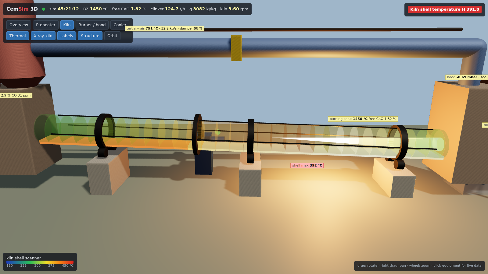

# CemSim OTS — open-source cement kiln-line operator training simulator

[](https://github.com/Arifuzzamanjoy/cemsim-ots/actions/workflows/ci.yml)
[](https://github.com/Arifuzzamanjoy/cemsim-ots/actions/workflows/codeql.yml)
[](https://github.com/Arifuzzamanjoy/cemsim-ots/actions/workflows/nightly.yml)
[](pyproject.toml)
[](LICENSE)
[](https://github.com/astral-sh/ruff)

An open-source operator training simulator (OTS) for the pyro-processing line of a cement
plant, in the spirit of commercial systems such as KHD Simulex®. It combines:

- **Process model:** a first-principles dynamic model of a 3000 t/d kiln line (5-stage
  preheater + calciner, rotary kiln, grate cooler, draught system). It conserves mass and
  energy by construction, and a test proves it.
- **Operator HMI:** a DCS-style browser interface with process mimics, faceplates, group
  start/stop sequences, interlocks, ISA-18.2 alarms and trends.
- **Trainer station:** 19 disturbances and failures, saved plant states (filesets), an event
  table, lab samples, performance scoring and a heat balance.
- **Live 3-D plant:** a to-scale three.js view (geometry designed in FreeCAD) animated by the
  live model; FreeCAD is not needed at runtime.

Equations, sources and assumptions are in **[docs/MODEL.md](docs/MODEL.md)**. The test
campaign, defects found and their fixes are in **[docs/VALIDATION.md](docs/VALIDATION.md)**.

> Simulex is a registered trademark of KHD Humboldt Wedag. This project is independent and
> not affiliated with or endorsed by KHD.

## Screenshots

### Operator HMI


*Kiln line overview: 5-stage preheater, calciner, rotary kiln and grate cooler with live values,
kiln-inlet and preheater-exit gas analysers, faceplates and the production & quality panel.*

| Trends during a disturbance | Kiln profiles & shell scanner |
|---|---|
|  |  |
| Main-burner coal heating value drops: burning zone falls 1450 → 1414 °C, free lime rises to 5 %, NO drops (the operator's early warning). | Gas / material / brick / shell temperatures along the kiln, shell scanner, cooler and preheater profiles. |


*Trainer station: speed-up, filesets (saved plant states), lab samples and the disturbance catalogue.*

### Live 3-D plant (`/3d`)


*The whole line in 3-D, driven by the live model: shell-scanner colours on the rotating kiln,
temperature-tinted cyclones and calciner, stack plume and live value tags.*

| Preheater tower | X-ray kiln view |
|---|---|
|  |  |
| Cyclones with tangential inlets, risers and meal pipes, calciner and gooseneck (geometry designed in FreeCAD). | X-ray mode: flame at the model's flame length and the material bed glowing by its temperature. |

## Quick start

```bash
git clone https://github.com/Arifuzzamanjoy/cemsim-ots && cd cemsim-ots
uv sync                                   # or: pip install -e .
uv run cemsim --port 8000                 # open http://localhost:8000, press "start"
```

Then open the **3D plant ↗** button, or http://localhost:8000/3d.

The calibrated filesets `data/snapshots/nominal.json` (steady operation) and `hot_standby.json`
(kiln on low fire, no feed) are included. After changing model parameters, re-settle them:

```bash
.venv/bin/python scripts/calibrate.py 10 nominal nominal   # closed loops + "expert operator" to steady state
.venv/bin/python scripts/make_scenarios.py                  # re-derive nominal + hot_standby
.venv/bin/python scripts/scenario_check.py cyclone          # upset responses: lhv | cyclone | idtrip | rpm
```

### Live 3-D plant (no FreeCAD needed)

Press **3D plant ↗** in the HMI footer or side bar, or open http://localhost:8000/3d. The page
is a three.js scene of the whole kiln line, driven by the same live data stream as the HMI:

- **Kiln:** the shell is painted in shell-scanner colours and the kiln turns at the real
  kiln speed.
- **Preheater:** cyclones and the calciner are tinted by their temperatures.
- **X-ray view:** shows the flame (with the model's flame length) and the glowing material
  bed inside the kiln.
- **Cooler:** the clinker bed shows the real bed depth and glows by temperature.
- **Equipment:** fan and drive lamps show run/fault status, and the stack plume follows the
  ID fan.
- **Operator tools:** value tags, camera presets, and click-on-equipment live data.

The geometry was designed in FreeCAD (`tools/freecad/build_plant3d.py`, 149 parts, zero clashes
by an automatic clash check) and exported to `cemsim/web/assets/plant3d.json` (~200 kB gzip).
three.js is bundled under `cemsim/web/vendor` (MIT), so there is no CDN and no FreeCAD at
runtime. To change the design, re-run the script inside FreeCAD (e.g. via the FreeCAD MCP):

```python
exec(open(r"C:\Users\Public\cemsim\build_plant3d.py").read())
build()
print(clashes())
export_json(r"C:\Users\Public\cemsim\plant3d.json")  # then copy to cemsim/web/assets/
```

Optional developer tool: `--freecad host:port` mirrors the live plant into a running FreeCAD.

## What is simulated

| Simulex component | CemSim |
|---|---|
| Unit models (Simulink: RaM, PrH, CaT, RKi, CC, CeM, CoM) | Python: `units/preheater.py` (PrH + CaT), `units/kiln.py` (RKi), `units/cooler.py` (CC), `units/draught.py`; raw, coal and cement mills not yet |
| PLC logic: group sequences, interlocks | `control.py` + `sim.py` (drives, groups with permissives/purge, trips) |
| WinCC OA managers / tag DB | `sim.Simulator` (fixed-step scan) + FastAPI/WebSocket server |
| DCS screens, setpoints, trends, alarms | `web/` (mimics, faceplates S/C, trends, ISA-18.2 alarms) |
| Trainer: model selection, disturbances, parameters | Trainer screen: 19 disturbances/failures, raw-mix and fuel attributes |
| Event tracking (table of events) | Events screen: every operator, trainer and interlock action |
| Performance evaluation | Scoring screen: weighted criteria (band / average / max / min / IAE) |
| Load/save filesets, acceleration 1–50 cycles/s | Trainer screen and footer |
| Heat balance | Heat balance screen (kJ/kg clinker by loss channel) |

## Development and CI

```bash
uv sync --group dev --group e2e && uv run pre-commit install
uv run ruff check . && uv run ruff format --check .
uv run pytest                                          # physics, plant, regressions
uv run playwright install chromium && bash scripts/ci_e2e.sh   # browser end-to-end
```

| Workflow | What it checks |
|---|---|
| **CI** (every push / PR) | ruff lint + format, pre-commit hygiene · pytest on Python 3.11–3.14 (Linux) and 3.13 (Windows, macOS) with coverage · minimum dependency versions · browser end-to-end in headless Chromium (HMI click-through, mimic layout, HiDPI charts, 3-D WebGL page, API hardening, FreeCAD bridge against a mock) · `pip-audit` · wheel build |
| **CodeQL** (push / PR / weekly) | security & quality analysis of Python, JavaScript and the workflows |
| **Nightly validation** | robustness sweep of all disturbances at their extremes (conservation, NaN, bounds, solver convergence) · start-up from hot standby to full production · controlled shutdown |
| **Dependabot** | weekly updates for `uv.lock` and GitHub Actions |

The tests cover:

- NIST cp reproduction
- reaction enthalpies and theoretical heat of clinker formation
- LHV release and adiabatic flame temperature
- Bogue consistency and elemental balances
- plant-wide mass (< 10⁻⁵) and energy (< 0.3 % of fuel) closure
- draught design point and response directions
- interlocks and burner purge sequence
- snapshot determinism
- regression tests for every defect in `docs/VALIDATION.md`

See [CONTRIBUTING.md](CONTRIBUTING.md).

## Layout

```
cemsim/thermo.py      species data, absolute enthalpies, melt
cemsim/chemistry.py   raw mix, kinetics, Bogue
cemsim/fuels.py       coal definition, combustion
cemsim/units/         kiln, preheater+calciner, cooler, draught
cemsim/plant.py       unit coupling, KPIs, heat balance, conservation accounting
cemsim/control.py     drives, groups, PID, alarms
cemsim/sim.py         simulator scan, commands, snapshots, trends
cemsim/trainer.py     disturbances, scoring, event log, lab
cemsim/server.py      FastAPI + WebSocket
cemsim/fileset.py     portable JSON filesets (saved states)
cemsim/web/           HMI (vanilla JS/SVG), 3-D page (three.js, vendored)
cemsim/freecad_bridge.py  live FreeCAD 3-D model
scripts/              calibration, scenarios, CI end-to-end runner
tests/                pytest suites; tests/validation: browser e2e, robustness, operating sequences
tools/freecad/        FreeCAD design script of the 3-D plant
.github/              CI, CodeQL, nightly validation, Dependabot, templates
```
